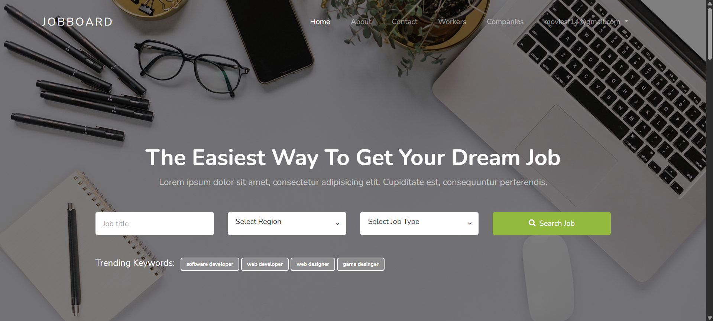
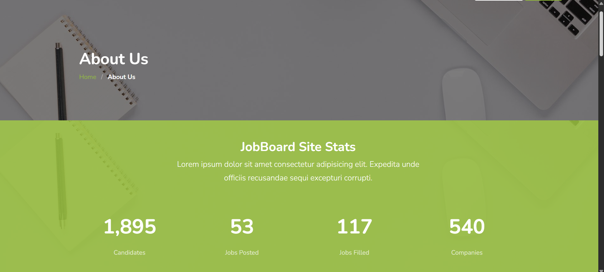
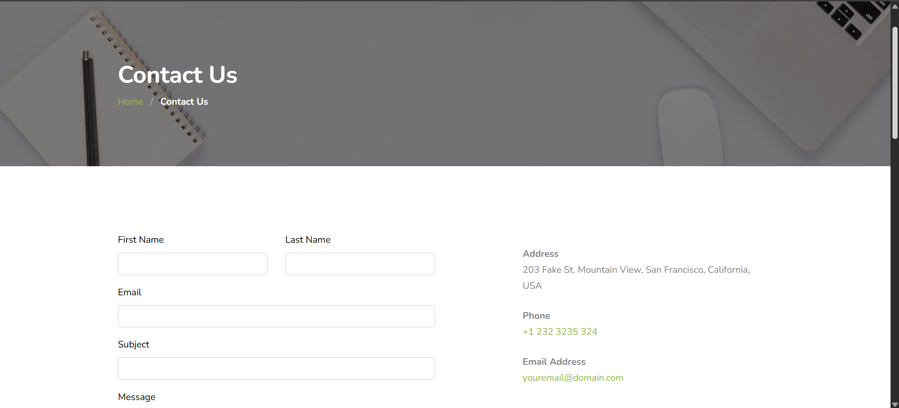

💼 Jobboard: Job Seeking Platform
   Jobboard is a PHP-based web application designed to connect job seekers with employers. The platform allows users to browse job listings, apply for positions, and manage their profiles, while employers can post job openings and manage applications through an intuitive admin panel.
    
🚀 Features
    User Authentication: Secure login and registration system for job seekers and employers.
    
    Job Listings: Browse available job opportunities with detailed descriptions.
    
    Job Application: Apply for jobs directly through the platform.
    
    Admin Panel: Employers can post new jobs, manage existing listings, and review applications.
    
    Responsive Design: Optimized for desktops, tablets, and mobile devices.
    
    Search Functionality: Search for jobs based on keywords and categories.
    
    Contact Page: Dedicated page for user inquiries and support.

🛠️ Tech Stack
    Frontend: HTML5, SCSS/CSS3, JavaScript
    
    Backend: PHP
    
    Database: MySQL
    
    Version Control: Git

📁 Project Structure

   
    Jobboard-Job-Seeking-Platform/
    ├── admin-panel/       # Admin dashboard and management tools
    ├── auth/              # User authentication scripts
    ├── categories/        # Job categories
    ├── config/            # Database configuration files
    ├── css/               # Stylesheets
    ├── fonts/             # Font files
    ├── general/           # General utilities and helpers
    ├── images/            # Image assets
    ├── includes/          # Reusable PHP components (e.g., header, footer)
    ├── jobs/              # Job-related scripts and data
    ├── js/                # JavaScript files
    ├── scss/              # SCSS files
    ├── users/             # User profile and account management
    ├── 404.php            # Custom 404 error page
    ├── about.php          # About us page
    ├── contact.php        # Contact information and form
    ├── index.php          # Homepage
    ├── search.php         # Search results page
    ├── README.md          # Project documentation
    └── .gitattributes     # Git attributes file
## 📸 Screenshots

### 🏠 Home Page  

### ℹ️ About Page  

### 📞 Contact Page  

⚙️ Getting Started
    Prerequisites
    PHP 7.x or higher
    
    MySQL or compatible database
    
    Web server (e.g., Apache, Nginx)

Installation
    Clone the Repository
    
    bash
    Copy
    Edit
    git clone https://github.com/bhaktofmahakal/Jobboard-Job-Seeking-Platform.git
Set Up the Database
  
  Create a new MySQL database named jobboard.
  
  Import the provided SQL file (if available) to set up the necessary tables and data.
  
  Configure Database Connection
  
  Navigate to the config/ directory.
  
  Open the database configuration file (e.g., config.php) and update the database credentials:
  
  php
  Copy
  Edit
  define('DB_SERVER', 'localhost');
  define('DB_USERNAME', 'your_username');
  define('DB_PASSWORD', 'your_password');
  define('DB_NAME', 'jobboard');
  Deploy the Application
  
  Place the project folder in your web server's root directory (e.g., htdocs for XAMPP).
  
  Start your web server and navigate to http://localhost/Jobboard-Job-Seeking-Platform/ in your browser.

📸 Screenshots
  Include screenshots of the homepage, job listings, job application page, and admin panel here.

🤝 Contributing
   Contributions are welcome! To contribute:

Fork the repository.

    Create a new branch:

    bash
    Copy
    Edit
    git checkout -b feature/YourFeature
    Commit your changes:
    
    bash
    Copy
    Edit
    git commit -m "Add YourFeature"
    Push to the branch:
    
    bash
    Copy
    Edit
    git push origin feature/YourFeature
    Open a pull request describing your changes.

📄 License
      This project is licensed under the MIT License.

📬 Contact
    For any inquiries or feedback, please contact :utsavmishraa005@gmail.com

